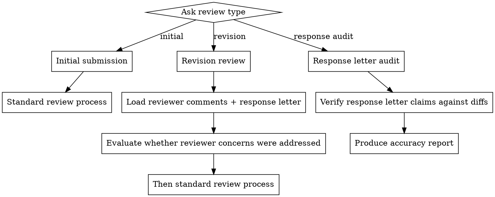
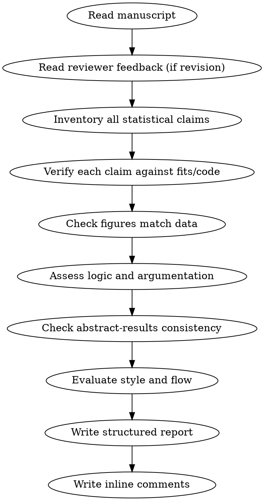

# Manuscript Review

## Overview

Blunt, thorough scientific manuscript review. Reads the manuscript, associated data/code outputs, figures, and reviewer feedback to produce a structured report followed by inline paragraph-level comments. Tone: Reviewer 2 — misses nothing, pulls no punches.

## When to Use

- User asks you to review, critique, or give feedback on a manuscript (.docx)
- User asks you to check statistical claims against code/data
- User asks you to prepare for reviewer responses
- User wants to identify weaknesses before submission
- User asks you to verify a response letter against manuscript changes
- User wants to check that revision claims are accurate before resubmission

## First: Determine Review Type

Before doing anything else, ask the user:

**"What type of review do you need?"**



### If Initial Submission

Proceed directly to Inputs to Gather (skip reviewer-specific inputs 2 and 3).

### If Revision

**Required additional inputs:**
- The reviewer comments (.docx) — what was criticized
- The author response letter (.docx) — what was promised
- The revised manuscript (.docx) — what was actually changed

**Before the standard review, evaluate the revision:**
- For each reviewer concern: was it actually addressed, or just acknowledged?
- Do the changes in the revised manuscript match what the response letter claims?
- Were any promises made in the response letter not followed through in the text?
- Did the revision introduce new problems (inconsistencies, overcorrections, broken references)?
- Are there reviewer concerns that were deflected rather than addressed — and was the deflection justified?

Add a dedicated section to the structured report:

```markdown
## Revision Adequacy
| Reviewer concern | Response letter claim | Actually addressed? | Notes |
|---|---|---|---|
```

### If Response Letter Audit

**Purpose:** Verify that the response letter accurately describes the changes between the original and revised manuscript. Catches lies, exaggerations, and unfulfilled promises before the letter reaches the editor.

**Required inputs:**
- The original manuscript (.docx) — pre-review version
- The revised manuscript (.docx) — post-review version with changes accepted
- The response letter (.docx) — what the authors claim they changed

**Process:**

1. **Extract all claims from the response letter.** For each reviewer comment, identify every specific promise: "we added X," "we revised Y," "we now include Z," "we replaced A with B."

2. **Verify each claim against the actual manuscripts.** Compare original vs. revised:
   - If the letter says "we added a sentence about X" — find that sentence in the revision and confirm it's absent from the original
   - If the letter says "we replaced ADHD with LA throughout" — search the revised manuscript for remaining instances of the old term
   - If the letter says "we now report statistic X" — find it in the revised text
   - If the letter says "we performed analysis X" — check that output files exist AND results appear in the manuscript

3. **Categorize each claim:**
   - **Accurate** — change exists exactly as described
   - **Partially accurate** — change was made but incompletely (e.g., "replaced throughout" but instances remain)
   - **Overstated** — change is less substantial than the letter implies
   - **Inaccurate** — change was not made, or the letter mischaracterizes what was done
   - **Unverifiable** — cannot confirm from available files

4. **Check for undisclosed changes.** Identify substantive differences between original and revised manuscript that are NOT mentioned in the response letter. Authors sometimes make silent changes — these should be flagged.

**Output format:**

```markdown
# Response Letter Audit: [Title]

## Summary
X/Y claims verified as accurate. Z claims partially accurate. W claims inaccurate.

## Claim-by-Claim Verification
| # | Response letter claim | Verified? | Evidence | Action needed |
|---|---|---|---|---|

## Undisclosed Changes
[Changes found in the revised manuscript not mentioned in the response letter]

## Incomplete Revisions
[Promises made but only partially fulfilled — specific instances that were missed]

## Recommendations
[What to fix in the response letter before submission]
```

**Tone for this mode:** Even more exacting than the standard review. The response letter is a formal communication to an editor who will use it to evaluate your good faith. Any inaccuracy — even accidental — damages credibility. Flag everything.

## Inputs to Gather

Before starting the review, collect ALL of the following:

1. **Manuscript file** (.docx) — read with the docx parsing approach
2. **Prior reviewer comments** (.docx) — revision only; understand what was raised
3. **Author response letters** (.docx) — revision only; understand what was promised
4. **Figures** (PNG/PDF in figures/) — verify they match claims
5. **Statistical outputs** (fits/*.csv, fits/*.txt) — ground truth for every reported number
6. **Analysis code** (src/r/, src/) — understand what was actually done vs. what's described

**CRITICAL: Never review a manuscript without checking the data outputs. A review that doesn't verify claims against code is worthless.**

## Review Process



### Step 1: Statistical Audit (most important)

For EVERY number in the manuscript:
- Find the source file in fits/ or the code that produces it
- Verify the number matches (within rounding)
- Flag any discrepancy, no matter how small
- Flag any unreported analysis that contradicts a claim
- Flag any selective reporting (analyses run but not mentioned)

**Neuroimaging-specific checks:**
- LME: Are random effects justified? Are df reported correctly (Satterthwaite/KR)?
- FDR: Is correction applied at the right level? Per-modality vs. global?
- GAMs: Are smooth term EDFs reported? Is tensor vs. additive distinction clear?
- Effect sizes: Are Cohen's d / partial R² reported alongside p-values?
- Multiple comparisons: Are all conducted tests accounted for in correction?
- Sample sizes per cell: Are any cells dangerously small (< 30)?

### Step 2: Logic and Argumentation

- Does each claim follow from the evidence presented?
- Are null results acknowledged honestly or swept under the rug?
- Are alternative explanations addressed?
- Does the Discussion overstate what the data show?
- Are limitations genuine or performative?
- Is there cherry-picking (reporting only favorable subanalyses)?

### Step 3: Rhetoric and Framing

- Does the framing match the evidence strength?
- Are causal claims made from correlational data?
- Is hedging language appropriate (not too strong, not weaselly)?
- Does the Introduction set up claims the Results can't deliver?
- Are contradictory findings from the literature acknowledged?

### Step 4: Style and Flow

- Paragraph transitions: does each paragraph connect to the next?
- Sentence-level clarity: any ambiguous antecedents, garden-path sentences?
- Jargon: is terminology consistent throughout?
- Figure references: are all figures cited in order? Do citations match content?
- Heading/section structure: logical flow?

### Step 5: Figure Verification

For each figure referenced in the manuscript:
- Open the image file and describe what it shows
- Does the figure match the claims made about it in the text?
- Are axis labels, legends, and captions correct and consistent with terminology in the text?
- Do bar heights / effect directions / significance markers match the reported statistics?
- Are any important results visible in the figure but not mentioned in the text?
- Flag caption errors (e.g., outdated terminology from a previous draft)

### Step 6: Abstract-Results Consistency

- Every claim in the abstract must appear in Results
- No result in the abstract that isn't the primary finding
- Effect sizes and p-values must match between abstract and body

### Step 7: Reproducibility Check

- Are the methods detailed enough for an independent researcher to replicate the analysis?
- Are software versions, packages, and specific algorithms named?
- Are thresholds, exclusion criteria, and covariates fully specified?
- Are random seeds or permutation counts reported where relevant?
- Is the data availability statement accurate and sufficient?

## Output Format

### Part 1: Structured Report

```markdown
# Manuscript Review: [Title]

## Critical Issues (must fix before publication)
[Factual errors, selective reporting, statistical mistakes]
Each item: what's wrong, where it is, what the data actually show, how to fix it.

## Major Issues (significantly weakens the paper)
[Logic gaps, missing context, understated limitations, overstatements]

## Minor Issues (should fix but won't kill the paper)
[Inconsistencies, style problems, missing citations, unclear passages]

## Verification Summary
| Claim (manuscript location) | Source file | Match? | Notes |
|---|---|---|---|

## Unreported Analyses
[Analyses found in fits/ or code that are relevant but not mentioned]
```

### Part 2: Inline Comments

Go paragraph by paragraph through the ENTIRE manuscript. Do not skip sections. For each paragraph with an issue:

```markdown
### [Section] — Paragraph starting "..."
- [STAT] Reported X, data shows Y (source: fits/file.csv)
- [LOGIC] Claim doesn't follow because...
- [STYLE] Sentence is ambiguous; could mean A or B
- [FLOW] Transition from previous paragraph is abrupt
- [OMISSION] Related finding not mentioned: ...
- [FIGURE] Figure X does not match / caption is wrong / axis label incorrect
- [REPRO] Method detail missing — cannot replicate without knowing X
```

**Completeness rule:** Every section of the manuscript must have at least one inline comment — even if only to note "no issues." If you find yourself skipping large sections of the Discussion or Methods, go back and read them again. Discussion paragraphs are where overstatements hide.

## Tone Rules

- Be blunt. "This is wrong" not "this might warrant reconsideration."
- Be specific. Quote the text, cite the source file, give the correct number.
- Be actionable. Every criticism must include what to do about it.
- Don't praise. The author isn't paying you to feel good.
- Don't hedge. If something is wrong, say it's wrong.
- If you're uncertain, say "I cannot verify this — provide source" rather than letting it slide.

## Common Neuroimaging Manuscript Pitfalls

- Reporting binary significance without effect sizes
- Comparing DKI-FA results to DTI-FA literature without noting the difference
- Citing vertex counts without specifying masking/exclusion
- Mixing data releases without confirming sample overlap
- Using "trend toward significance" for p > 0.05
- Claiming regional specificity when global correction eliminates all clusters
- Not reporting the proportion of robustness iterations that lose significance
- Framing sensitivity analyses as "confirming" when only a subset of thresholds work

## What NOT to Do

- Don't skip the statistical audit because it's tedious
- Don't assume reported numbers are correct
- Don't soften language to be polite
- Don't ignore supplementary analyses — they often hide the real story
- Don't review without reading the reviewer comments (if they exist)
- Don't provide feedback on style alone — substance first, always
